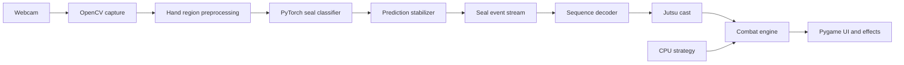

# Jutsu Battle


[](https://github.com/Yajush-afk/jutsu-battle/actions/workflows/ci.yml)

**Jutsu Battle** is an offline, webcam-controlled battle game inspired by the
hand seals and elemental combat of *Naruto*. Instead of selecting an attack
with a keyboard or controller, the player weaves a sequence of hand seals in
front of the camera. The recognition engine converts that sequence into a
jutsu and the combat engine resolves it against the CPU opponent's attack.

The player and CPU cast simultaneously. Winning requires more than performing
the strongest technique: the player must manage chakra, anticipate the
opponent's element, choose efficient jutsu, and account for persistent status
effects.

## Gameplay

Each match follows a timed player-versus-CPU format:

1. Learn the hand-seal sequences for the available jutsu.
2. Choose four techniques from the full jutsu roster.
3. Enter a timed round while the CPU secretly commits to an attack.
4. Weave a valid hand-seal sequence before the casting window closes.
5. Reveal both techniques and resolve their elemental power, damage, and
   possible status effects.
6. Regenerate chakra and continue until a combatant is defeated.

The game supports the twelve animal hand seals:

```text
Bird · Boar · Dog · Dragon · Hare · Horse
Monkey · Ox · Ram · Rat · Serpent · Tiger
```

## Jutsu system

The roster contains fifteen techniques—three for each elemental nature:

| Tier | Role | Chakra | Combat value |
|---|---|---:|---|
| Low | Fast, reliable finishing attack | Low | Low-to-moderate damage and effect chance |
| Tactical | Elemental counter and pressure tool | Medium | Stronger damage and status chance |
| Super | Match-ending flagship technique | Maximum | One-hit potential if it wins the clash |

The five elemental natures form a counter cycle:

```text
Fire → Wind → Lightning → Earth → Water → Fire
```

Jutsu strength is determined by its tier, elemental matchup, chakra cost, and
active status modifiers. Fire can burn, water can soak, wind can weaken, earth
can restrict chakra recovery, and lightning can disrupt elemental power.

## Core features

- Real-time recognition of all twelve two-handed seals
- Sequence-based casting rather than single-pose shortcuts
- Fifteen jutsu across five elemental natures
- Four-technique pre-match selection
- Timed simultaneous rounds against a rule-based CPU
- Health, chakra, regeneration, elemental clashes, and status effects
- Learn and calibration screens for practising seals before battle
- Local webcam processing with no required cloud service
- Procedural particles, flashes, trails, and impact feedback
- Configurable recipes and balance values instead of hardcoded content
- Accessibility controls for flashes, particles, screen shake, and audio

## System architecture



The vision layer emits confirmed seal events and remains independent from the
combat rules. The combat engine consumes completed jutsu identifiers and has no
knowledge of webcam frames or model tensors. This separation keeps recognition,
gameplay, and presentation independently testable.

## Tech stack

| Area | Technologies | Purpose |
|---|---|---|
| Language | Python 3.11 | Application, ML pipeline, and game logic |
| Deep learning | PyTorch, TorchVision | CNN training, transfer learning, and inference |
| Computer vision | OpenCV, MediaPipe | Webcam capture, hand tracking, landmarks, and cropping |
| Data and evaluation | NumPy, pandas, scikit-learn, Pillow | Dataset processing, metrics, and image handling |
| Desktop game | Pygame Community Edition | Windowing, input, HUD, animation, particles, and audio |
| Configuration | PyYAML | Seal recipes, jutsu definitions, and combat balance |
| Experiment tools | TensorBoard, Matplotlib, Seaborn | Training diagnostics and evaluation reports |
| Quality | Pytest, coverage.py, Ruff, mypy | Tests, coverage, linting, and static type checking |
| Environment and CI | Conda, GitHub Actions | Reproducible setup and automated verification |

## Development setup

The project uses the Conda environment name `naruto` and Python 3.11.

```bash
git clone https://github.com/Yajush-afk/jutsu-battle.git
cd jutsu-battle
conda env create --file environment.yml
conda activate naruto
python -m pip install --editable . --no-deps
```

Run the automated checks:

```bash
ruff check .
mypy src
pytest --cov=src
```

All gameplay and webcam inference are designed to run locally. The project does
not require paid APIs, paid assets, hosted inference, or an internet connection
during play.
